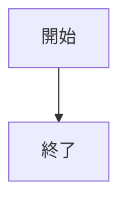
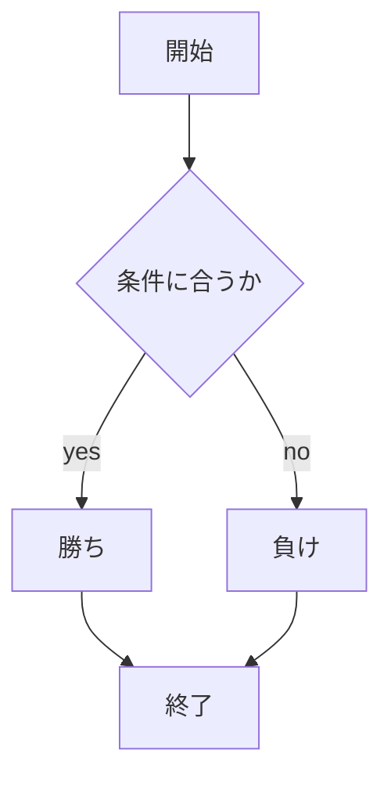

# webpro_06
10月29日(火)
## このプログラムについて
## ファイル一覧
ファイル名 | 説明 
-|-
app5.js | プログラム全体
public/janken.html | じゃんけんの開始画面
views/janken.ejs | じゃんけんのテンプレートファイル
```javascript
console.log( 'Hello' );
```
## 箇条書き
1. app5.js を起動する(```node app5.js```で起動)
1. Webブラウザでlocalhost:8080/public/janken.htmlにアクセスする
1. 自分の手を入力する

## 図

## フローチャート
