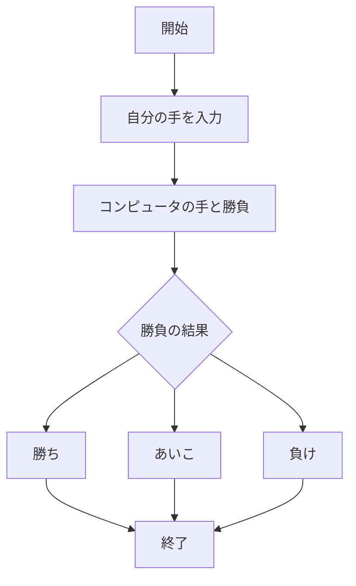
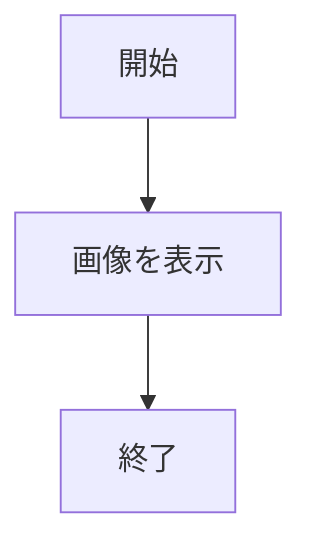
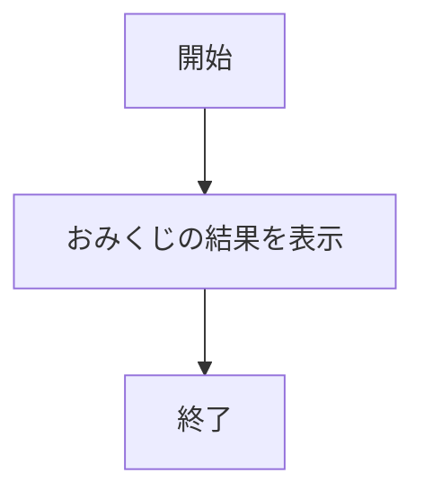
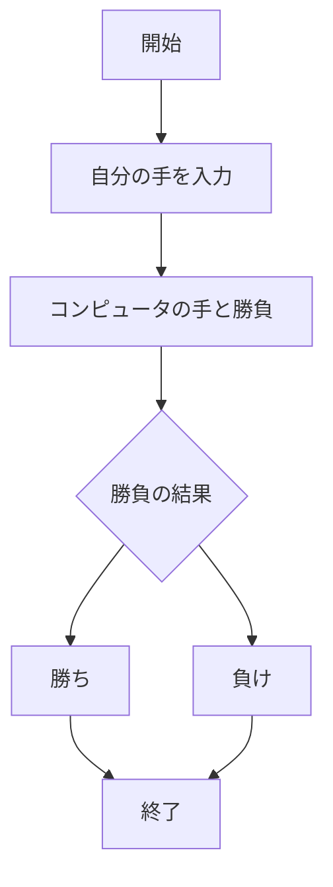
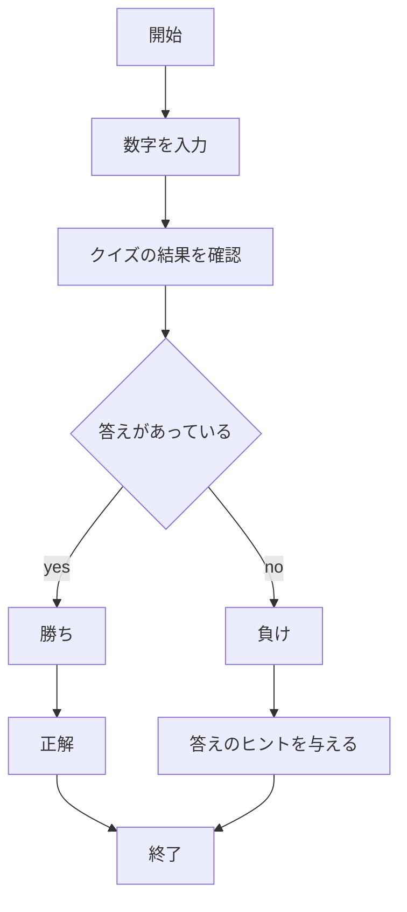

## app5.jsのドキュメント
## ファイル一覧
ファイル名 | 説明 
-|-
app5.js | プログラム全体
public/janken.html | じゃんけんの開始画面
views/janken.ejs | じゃんけんのテンプレートファイル
views/icon.ejs | アイコンのテンプレートファイル
views/luck.ejs | おみくじのテンプレートファイル
views/attimuitehoi.ejs | あっち向いてホイのテンプレートファイル
views/guess-number.ejs | 数字当てゲームのテンプレートファイル

## じゃんけんの起動手順
1. app5.js を起動する(```node app5.js```で起動)
1. Webブラウザでlocalhost:8080/public/janken.htmlにアクセスする
1. 自分の手を入力する

#### 機能の説明
コンピュータとじゃんけんができる機能である．


#### フローチャート


## アイコンの起動手順
1. app5.js を起動する(```node app5.js```で起動)
1. Webブラウザでlocalhost:8080/public/icon にアクセスする

#### 機能の説明
画像を表示する機能

#### フローチャート

## おみくじの起動手順
1. app5.js を起動する(```node app5.js```で起動)
1. Webブラウザでlocalhost:8080/public/luckにアクセスする

#### 機能の説明
おみくじができる機能

#### フローチャート


## あっち向いてホイの起動手順
1. app5.js を起動する(```node app5.js```で起動)
1. Webブラウザでlocalhost:8080/public/attimuitehoiにアクセスする
1. 手を入力する

#### 機能の説明
コンピュータとあっち向いてほいができる機能である．

#### フローチャート


## 数字当てゲームの起動手順
1. app5.js を起動する(```node app5.js```で起動)
1. Webブラウザでlocalhost:8080/public/guess-numberにアクセスする
1. 数字を入力する

#### 機能の説明
コンピュータと数字当てゲームができる機能である

#### フローチャート
